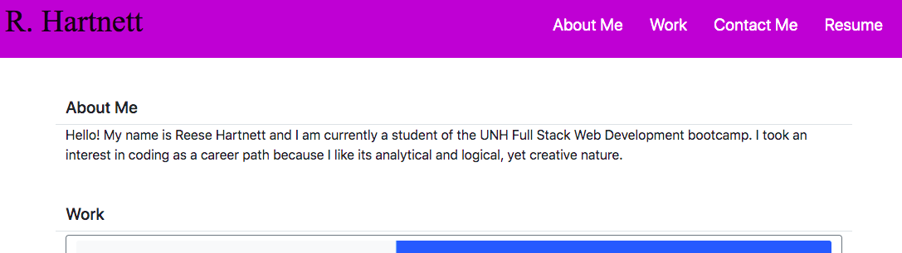

# Portfolio

## Table of Contents

- [Description](#description)
- [License](#license)
- [Installation](#installation)
- [Usage](#usage)

## Image

## Description

This is my portfolio, used to showcase my work to potenial employers, including those who are not coders themselves, as well as anyone interested.

## License

None

(Not licensed for use of any kind)

## Installation

The website is viewed using a browser.

## Usage

Aside from general and contact information, the site contains links at the top to navigate to different
sections, and links at the bottom to my Github, Linkedin, and resume. Also, each of the displayed projects
is linked as well - the title links to the project's repository in Github, and the picture itself links
to the deployed site, if applicable.

## Link to deployed site:
https://pasfrad.github.io/Portfolio/